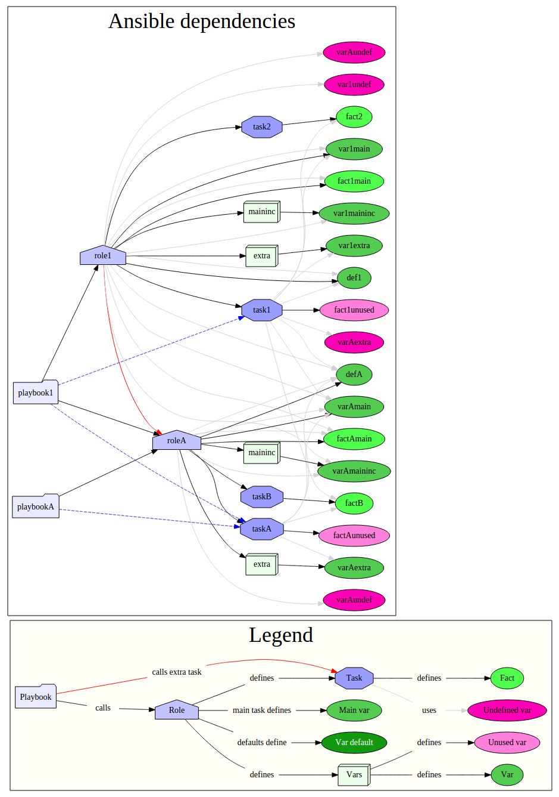

ansible-viz
===========

GraphViz depiction of Ansible dependencies.

Run:

    gem install bundler
    bundle install
    bundle exec ruby ansible-viz.rb <path-to-playbook-dir>

Now browse `viz.html` or `with-vars.html`. The diagram is drawn
client-side with [`viz.js`](https://github.com/mdaines/viz.js/).

There are probably still a few bugs, particularly around var usage tracking.

See [`sample/README.txt`](sample/README.txt) for details on test
data. Run

    bundle exec rake test

to execute tests and generate a coverage report. The tests create a
graph of the sample data in `test.html`.

## Example

## History

This tool was [originally written](https://github.com/lxsli/ansible-viz)
by [Alexis Lee](https://github.com/lxsli/ansible-viz), who kindly
[agreed to transfer maintainership over](https://github.com/lxsli/ansible-viz/issues/3)
so that the project could be revived.
